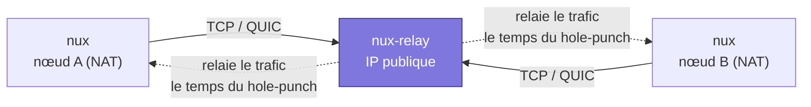
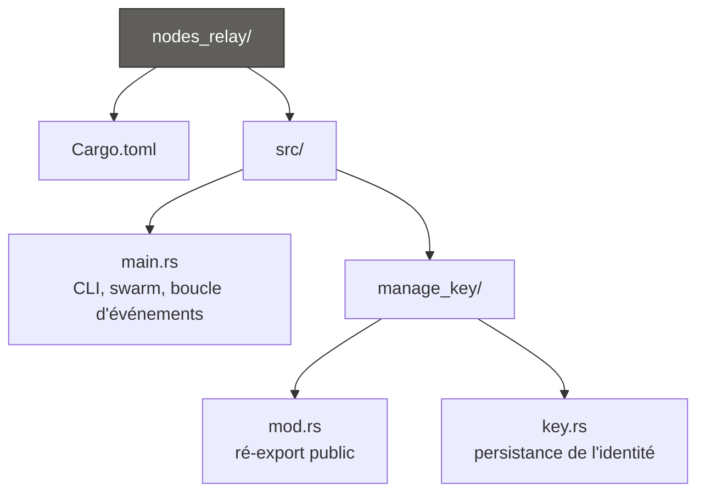
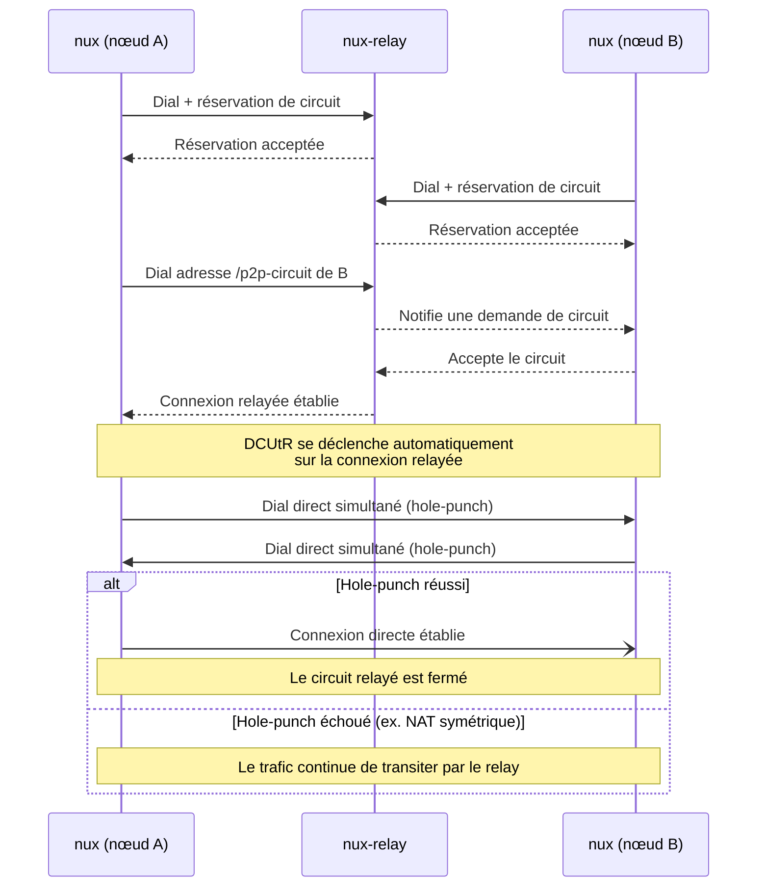

# nux-relay

Nœud relay libp2p (circuit relay v2) servant de point de rendez-vous public pour des pairs situés derrière un NAT. Conçu pour permettre, en combinaison avec le binaire client `nux`, l'établissement de tunnels P2P chiffrés et authentifiés — sans VPN.

## Rôle dans l'architecture



`nux-relay` ne fait que :
- accepter des réservations de circuit (`relay::Behaviour`) pour des pairs derrière NAT,
- relayer le trafic entre deux pairs le temps qu'un hole-punch DCUtR réussisse côté clients,
- s'identifier auprès des pairs connectés (`identify::Behaviour`) et maintenir les connexions actives (`ping::Behaviour`).

Il ne contient ni logique de hole-punching (`dcutr`) ni logique client (`relay::client`) — ces responsabilités appartiennent au binaire `nux`.

## Prérequis

- Rust (édition 2021 ou plus récente)
- Une machine avec une IP publique ou un port exposé (VM cloud, LoadBalancer K8s, etc.)
- Les ports choisis ouverts en **TCP et UDP** sur le firewall / security group

## Installation

```bash
git clone <repo>
cd nodes_relay
cargo build --release
```

## Utilisation

```bash
./target/release/nux-relay --port 4001 --key-path relay_identity.key --external-address /ip4/203.0.113.10/tcp/4001
```

### Arguments CLI

| Argument | Défaut | Description |
|---|---|---|
| `--port` | `4001` | Port TCP et UDP/QUIC sur lequel le relay écoute |
| `--key-path` | `relay_identity.key` | Chemin du fichier contenant la clé d'identité Ed25519 du relay |
| `--external-address` | *(aucune)* | Adresse publique de ce relay (répétable). **Requis en pratique** — voir ci-dessous. |

Au premier lancement, si `--key-path` n'existe pas, une nouvelle paire de clés Ed25519 est générée et sauvegardée à cet emplacement (permissions `0600` sur Unix). Aux lancements suivants, la même identité est rechargée — le `PeerId` du relay reste donc stable, ce qui est indispensable pour que les clients puissent le référencer de façon fiable dans leurs adresses `Multiaddr`.

### `--external-address` : pourquoi c'est nécessaire

Une réservation de circuit (`relay::Behaviour`) n'est acceptée que si le relay a au moins une **adresse externe confirmée** à transmettre au réservant. Normalement, cette confirmation vient du protocole `identify` : un pair connecté observe l'adresse à laquelle il vous voit et vous la rapporte. Mais aucun nœud `nux` (Client ni Guard) n'implémente `identify` — la négociation échoue systématiquement (visible en journal : `Identify event: Error { ... NegotiationFailed }`), donc le relay n'a **jamais** d'adresse confirmée par ce biais face à des pairs Nux.

Sans `--external-address`, le comportement est silencieux et non déterministe : selon les interfaces réseau détectées localement au démarrage, une réservation peut échouer (`NoAddressesInReservation`) ou, pire, réussir de façon incohérente et faire échouer la connexion d'un Client au travers du circuit plus tard (`NO_RESERVATION` côté protocole). **Toujours fournir `--external-address`** avec l'adresse publique réelle du relay en production.

### Exemple de sortie

```
Relay PeerId: 12D3KooWAbCdEf...
Écoute sur : /ip4/0.0.0.0/tcp/4001/p2p/12D3KooWAbCdEf...
Écoute sur : /ip4/0.0.0.0/udp/4001/quic-v1/p2p/12D3KooWAbCdEf...
```

Communique l'adresse complète (IP publique + port + PeerId) aux nœuds `nux` qui doivent s'y connecter, par exemple :

```
/ip4/203.0.113.10/udp/4001/quic-v1/p2p/12D3KooWAbCdEf...
```

## Structure du projet



## Flux complet (relay + hole-punch)



## Transports et comportements réseau

| Composant | Rôle |
|---|---|
| `tcp` | Transport TCP classique, chiffré via Noise, multiplexé via Yamux |
| `quic` | Transport QUIC (UDP), chiffrement et multiplexage intégrés au protocole |
| `relay::Behaviour` | Serveur de circuit relay v2 — accepte les réservations et relaie le trafic |
| `identify::Behaviour` | Échange les métadonnées de pair (adresses observées, protocoles supportés) |
| `ping::Behaviour` | Maintient les connexions actives et détecte les pairs déconnectés |

### Limites du relay

Configurées dans `relay::Config` pour éviter la saturation du nœud :

| Paramètre | Valeur |
|---|---|
| `max_reservations` | 128 |
| `max_reservations_per_peer` | 4 |
| `max_circuits` | 16 |
| `max_circuits_per_peer` | 4 |
| `max_circuit_duration` | 120 s |
| `max_circuit_bytes` | 1 MiB |

À ajuster selon la charge attendue — un circuit qui reste ouvert longtemps signifie généralement que le hole-punch DCUtR entre les deux clients a échoué et que le trafic transite en continu par le relay.

## Sécurité de l'identité

- La clé privée est encodée en protobuf et écrite sur disque avec des permissions restrictives (`0600`, propriétaire uniquement).
- Les buffers intermédiaires (lecture fichier, encodage) utilisent `Zeroizing<Vec<u8>>` afin d'être effacés de la mémoire dès qu'ils ne sont plus nécessaires, plutôt que d'être laissés à la merci du GC/swap.
- Ne jamais committer le fichier de clé dans le contrôle de version — ajoutez-le à `.gitignore`.
- En production (Kubernetes), monter la clé via un **Secret** en volume plutôt que de la régénérer à chaque redéploiement.

## Déploiement réseau — points d'attention

- **QUIC nécessite l'UDP** : vérifiez que le port choisi est ouvert en UDP en plus du TCP sur votre firewall / security group cloud.
- **Buffer socket UDP** : sous Linux, augmentez `net.core.rmem_max` et `net.core.wmem_max` à au moins `7500000` pour éviter les pertes de paquets sous charge :
  ```bash
  sudo sysctl -w net.core.rmem_max=7500000
  sudo sysctl -w net.core.wmem_max=7500000
  ```
- **Kubernetes** : le `Service` exposant le relay doit déclarer le port en `TCP` **et** en `UDP` (deux entrées distinctes dans `spec.ports`).

## Prochaine étape

Le binaire client `nux` (nœud derrière NAT) doit implémenter `relay::client::Behaviour` + `dcutr::Behaviour` + `identify::Behaviour`, dialer l'adresse de ce relay, puis dialer l'adresse `/p2p-circuit` de l'autre pair pour déclencher automatiquement la tentative de hole-punch DCUtR.
